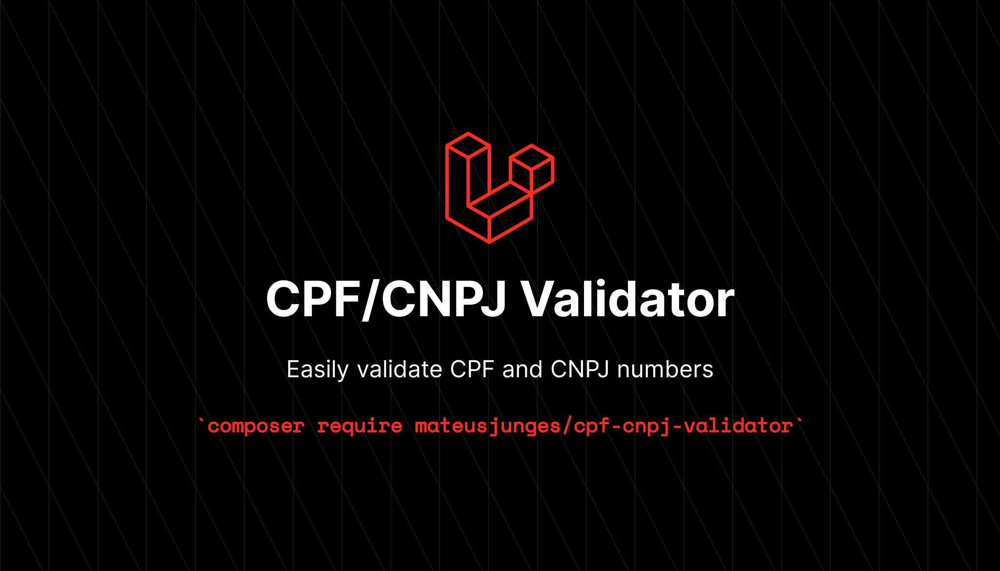

# CPF & CNPJ Validator


This package provide a simple API to validate brazilian CPF and CNPJ document numbers.

# Sponsor my work!
If you think this package helped you in any way, you can sponsor me on GitHub!

[](https://github.com/sponsors/mateusjunges)


### Installation
You can install this package using composer:

```bash
composer require mateusjunges/laravel-cpf-cnpj-validator
```

### Usage
To validate a document number, you can invoke the `Validator` class passing the `number` and optionally the document `type` as parameters:

```php
use Junges\CpfCnpjValidator\Validator;

$v = (new Validator)("360.928.960-01"); // True

$v = (new Validator)("360.928.960-01", \Junges\CpfCnpjValidator\Enums\TaxId::CPF); // True

$v = (new Validator)("360.928.960-01", \Junges\CpfCnpjValidator\Enums\TaxId::CNPJ); // False

$v = (new Validator)("91.881.588/0001-95"); // True

$v = (new Validator)("91.881.588/0001-95", \Junges\CpfCnpjValidator\Enums\TaxId::CNPJ); // True

$v = (new Validator)("91.881.588/0001-95", \Junges\CpfCnpjValidator\Enums\TaxId::CPF); // True
```

### Testing
Run `composer test` to test this package.

### Credits
- [Mateus Junges](https://twitter.com/mateusjungess)

### License
This package is open-sourced software licensed under the [MIT License](https://opensource.org/licenses/MIT). Please see the [License file](LICENSE) for more information.